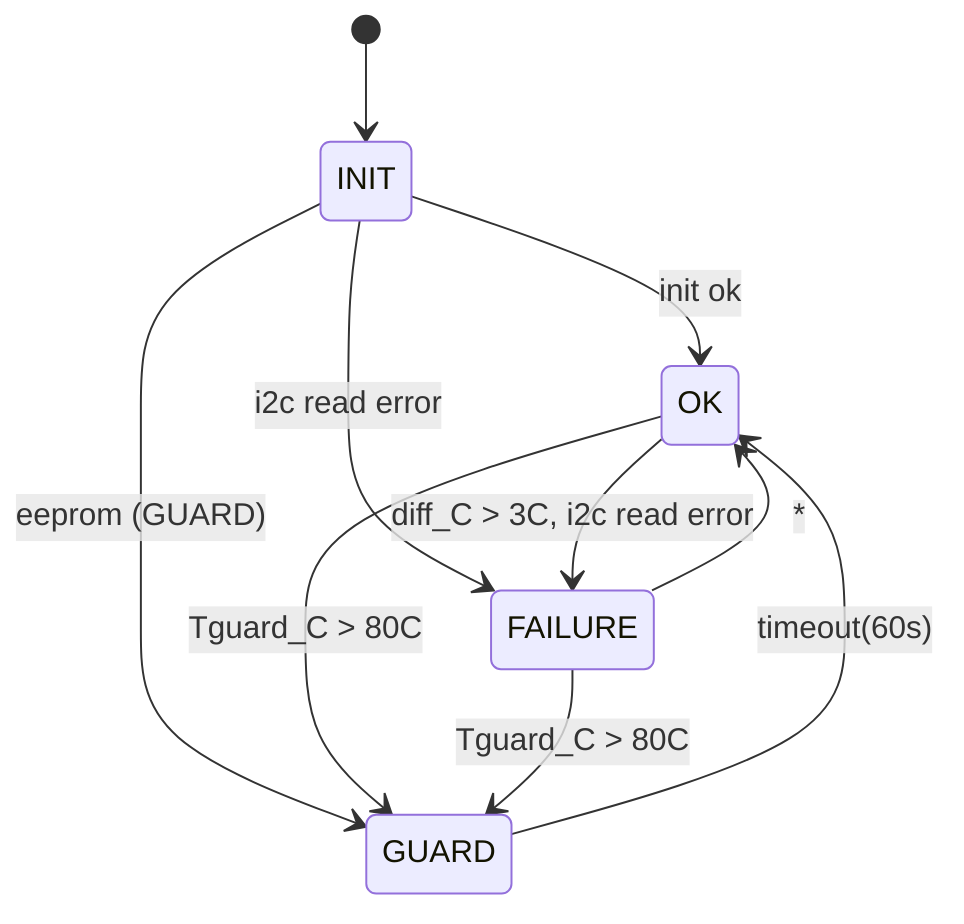

# Design

## Task

* simulate I2C

* DONE: diag protocol
* DONE: Write testenvironement, pytest, fixtures
* DONE:  pytest
* DONE: logger
* TODO: doc
* DONE: purge

## Simulate OneWire

* https://www.raspberrypi.com/documentation/microcontrollers/images/pico2w-pinout.svg
* https://www.elektronik-kompendium.de/sites/praxis/bauteil_ds18b20.htm

| Signal | Pico A | Pico B | Comment |
| - | - | - | - |
| OneWire | GP16 | GP16 | Pullup |
| SDA | GP14 | GP14 | Pullup |
| SCL | GP15 | GP15 | Pullup |

## diag protocol

```
<verb> <args>

# Examples heatgard -> pytest

probe state <enable> FAILURE <reason>
probe boot NORMAL|WATCHDOG <reason>

stimulus watchdog off
stimulus Tref_C 20.0
```


```
Constant	Meaning
machine.PWRON_RESET	Power-on reset
machine.HARD_RESET	Hard reset via RESET pin
machine.WDT_RESET	Watchdog timer reset
machine.DEEPSLEEP_RESET	Woke from deep sleep
machine.SOFT_RESET	Soft reset (e.g. machine.soft_reset())
```

Write EEPROM -> GUARD

  EEPROM SIM

a) stimulus watchdog

b) stimulus state.update_temperatures(temperature_Tguard_C=90.0, diff_C=0.0)


