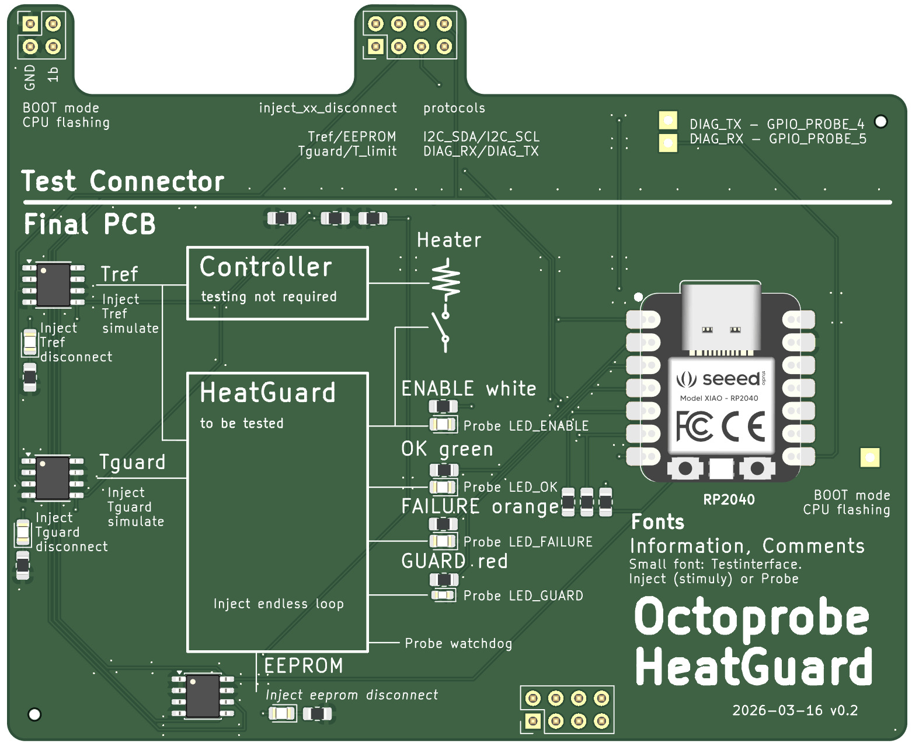

# Octoprobe Heatguard

## History v0.2 -> v0.3

* PCB/Schematics: Now using relays in favor of GPIO
* PCB/Schematics: Rename stimuly -> stimulus
* PCB silkscreen: Open Hardware logo
* PCB silkscreen: Insert missing text `Controller` / `testing not required`
* PCB silkscreen: Switch GPIO_PROBE_4 and GPIO_PROBE_4
* PCB: XIAO rp2040: Replace SMD with THT

## History v0.1 -> v0.2

[schematics](heatguard_v0.2/production_v0.2/schematics_heatguard_v0.2.pdf)

* XIAO: Now smd (was on pins)
* Now connect to tentacle via soldered 2 row pin connectors
* while LEDs for inject Tref/Tguard/EEPROM

## History v0.1

[schematics](heatguard_v0.1/production_v0.1/schematics_heatguard_v0.1.pdf)
